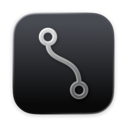
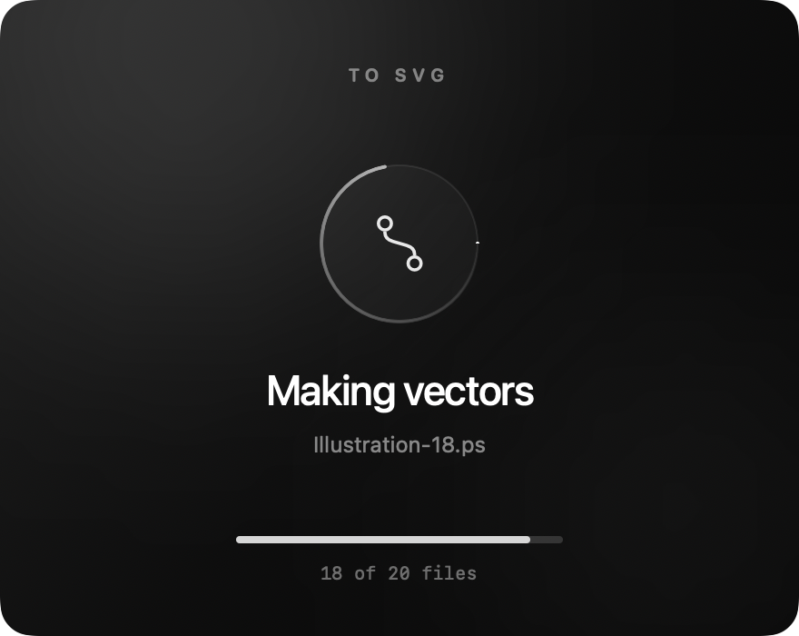
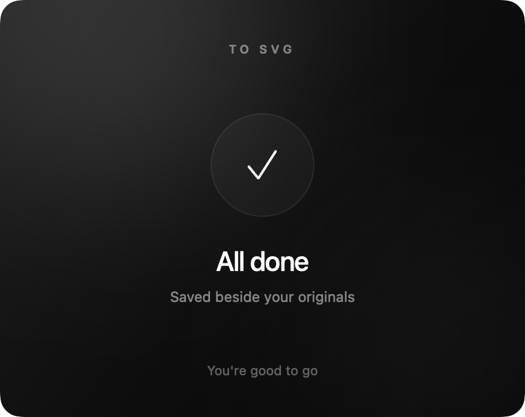

# To SVG



A small native macOS app. Select PDF, EPS, AI, or PS files in Finder, right-click → **Open With → To SVG**. SVGs appear in the source folder. You can also drag files over the window to reveal a drop zone and drop them to convert, drop files on the app icon, or launch it and choose files.

- Multiple files are queued in the background.
- Single-page files produce `name.svg`; multipage files produce `name-page-1.svg`, etc.
- Existing files are never overwritten: repeated conversions add ` (2)`, ` (3)`, etc.
- A minimal gradient window shows an animated conversion ring and batch progress.
- Successful conversions show a brief checkmark, then automatically close the window. Errors stay visible so you can read them.
- Animation respects the macOS Reduce Motion setting.
- Processing is local, with no uploads.

## A quick look

| Converting | Done |
| --- | --- |
|  |  |

Drag files over the window to reveal **Drop to convert**, or use **Choose files**. The window closes automatically after a successful conversion.

The app icon uses the curved vector path from the loading indicator. The current artwork is in [assets/AppIcon.icon](assets/AppIcon.icon), editable in Apple Icon Composer. The build uses Apple’s asset compiler to produce the layered macOS icon and an ICNS fallback.

## Build and install

Requires macOS 13+ to run and Xcode 26+ to build the Icon Composer artwork. Build for the current Mac:

```sh
brew install poppler ghostscript
./scripts/build.sh
cp -R 'build/To SVG.app' /Applications/
open '/Applications/To SVG.app'
```

If Finder hasn't listed it yet, use **Open With → Other…**, then select the app in the shared Applications folder. This does not change your default PDF viewer.

The app finds Homebrew tools in `/opt/homebrew/bin` or `/usr/local/bin`. The tools are not bundled; keep Poppler and Ghostscript installed. The local build is ad-hoc signed, not notarized for distribution.

## Format support

PDF-compatible Illustrator files and older PostScript Illustrator files are supported. For other AI files, save in Illustrator with **Create PDF Compatible File** enabled, or export PDF first. Password-protected PDFs must be unlocked first.

Poppler exports vector paths where supported; source raster images remain raster images, and some complex effects may be rasterized. Text may become glyph outlines. This is format conversion, not bitmap tracing. EPS/PostScript are normalized through Ghostscript before SVG conversion. Each converter process has a three-minute timeout.

Conversion uses [Poppler's pdftocairo](https://gitlab.freedesktop.org/poppler/poppler) and [Ghostscript](https://ghostscript.com/).

## Verification

```sh
./tests/smoke.sh
```

Tests real EPS, multipage PDF, PDF-compatible AI, PostScript AI, unsupported AI, collision handling, special-character filenames, and vector SVG structure. CLI mode is also available:

```sh
'build/To SVG.app/Contents/MacOS/ToSVG' --convert /absolute/path/file.pdf
```
